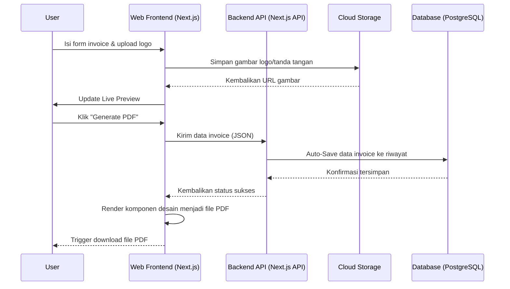
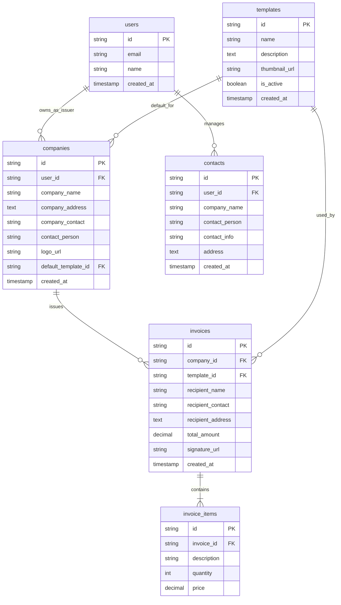

# PRD — Project Requirements Document

## 1. Overview
Bagi para pekerja lepas (freelancer) dan penjual (seller), membuat tagihan atau invoice secara manual seringkali memakan waktu dan rentan terhadap kesalahan. Aplikasi pembuat invoice ini dirancang untuk menyelesaikan masalah tersebut dengan menyediakan platform yang cepat, sederhana, dan profesional. Tujuan utama dari aplikasi ini adalah memfasilitasi pengguna untuk memasukkan detail bisnis mereka (termasuk logo), informasi penerima, daftar barang/jasa beserta harganya, dan tanda tangan digital, yang kemudian diubah secara instan menjadi dokumen PDF yang rapi. Dengan tambahan fitur penyimpanan otomatis, pengguna dapat bekerja lebih efisien tanpa takut kehilangan riwayat tagihan mereka.

## 2. Requirements
- **Kemudahan Penggunaan (Usability):** Antarmuka (UI) harus sangat intuitif sehingga pengguna yang tidak paham teknis pun dapat membuat invoice dalam hitungan menit.
- **Kinerja (Performance):** Proses pembuatan dan pengunduhan PDF harus berjalan cepat tanpa waktu tunggu yang lama.
- **Penyimpanan Otomatis (Auto-Save):** Sistem harus bisa menyimpan draf atau invoice yang sudah jadi secara otomatis agar riwayat tagihan pengguna tetap aman dan mudah diakses kembali.
- **Kustomisasi Dasar:** Dokumen yang dihasilkan harus bisa menampilkan identitas pengguna dengan jelas melalui logo perusahaan dan tanda tangan digital (baik diunggah maupun digambar langsung).
- **Aksesibilitas (Responsiveness):** Aplikasi harus nyaman digunakan baik melalui komputer (desktop) maupun telepon genggam (mobile).

## 3. Core Features
- **Manajemen Multi-Perusahaan (Multi-Company Management):** Pengguna dapat membuat dan mengelola lebih dari satu profil bisnis. Setiap profil bisnis memiliki data terpisah seperti logo, nama perusahaan, kontak, alamat, dan preferensi template default. Pengguna dapat dengan mudah beralih antar profil bisnis saat membuat invoice baru atau melihat riwayat invoice yang terasosiasi dengan masing-masing perusahaan.
- **Manajemen Kontak Penerima (Recipient/Client Contact Management):** Pengguna dapat menyimpan profil klien atau penerima yang sering dituju sebagai kontak tersendiri. Setiap kontak penerima menyimpan informasi seperti nama perusahaan/klien, nama kontak personal (contact person), nomor telepon/email, dan alamat tagihan. Saat mengisi data penerima pada invoice, pengguna dapat memilih dari daftar kontak yang sudah tersimpan untuk mempercepat proses pengisian tanpa harus mengetik ulang. Kontak penerima ini terpisah dari profil bisnis milik pengguna (issuer), sehingga pengguna dapat membedakan dengan jelas antara profil perusahaan sendiri dan profil klien yang ditagih.
- **Manajemen Profil Bisnis:** Pengguna dapat mengunggah logo perusahaan, nama, kontak, dan alamat perusahaan secara default untuk setiap profil bisnis yang dimiliki. Setiap profil bisnis juga dilengkapi dengan informasi contact person internal (misalnya nama pemilik atau manajer yang bertanggung jawab) untuk keperluan administratif.
- **Template Invoice (Template Selection):** Tersedia beberapa pilihan template desain invoice yang beragam (misalnya: Klasik, Modern, Minimalis, Profesional). Pengguna dapat memilih template yang diinginkan saat membuat invoice baru, dan template yang dipilih akan langsung diterapkan pada Live Preview. Setiap perusahaan dapat memiliki template default yang akan otomatis terpilih saat membuat invoice untuk perusahaan tersebut.
- **Input Data Penerima:** Formulir cepat untuk memasukkan nama klien, kontak, dan alamat tagihan. Pengguna dapat memilih penerima dari daftar kontak yang sudah disimpan, atau mengisi secara manual untuk penerima baru.
- **Tabel Daftar Harga (Line Items):** Kemampuan untuk menambahkan beberapa baris barang/jasa, kuantitas, dan harga. Sistem akan menghitung total harga (kalkulasi) secara otomatis.
- **Tanda Tangan Digital:** Pengguna dapat mengunggah file tanda tangan untuk dibubuhkan di bagian bawah invoice.
- **Live Preview & PDF Generator:** Fitur untuk melihat pratinjau invoice secara langsung (real-time) sesuai gaya aslinya, dilengkapi dengan satu tombol "Generate PDF" untuk langsung mengunduh file hasil jadi.
- **Riwayat Invoice (Auto-Save):** Dasbor sederhana yang menyimpan seluruh invoice yang pernah dibuat, memungkinkan pengguna untuk melihat kembali atau mengunduh ulang PDF di kemudian hari. Riwayat dapat difilter berdasarkan perusahaan yang dipilih.

## 4. User Flow
1. **Registrasi/Masuk:** Pengguna masuk ke dalam aplikasi untuk mengakses akun pribadi mereka.
2. **Dasbor Utama:** Pengguna melihat ringkasan akun, daftar perusahaan yang telah dibuat, daftar kontak penerima yang tersimpan, dan riwayat seluruh invoice dari semua perusahaan. Pengguna dapat memilih perusahaan aktif atau membuat perusahaan baru. Terdapat tombol "Buat Invoice Baru" yang akan menggunakan perusahaan yang sedang aktif.
3. **Manajemen Perusahaan:**
   - Pengguna dapat menambahkan perusahaan baru dengan mengisi nama, alamat, kontak, contact person internal, dan mengunggah logo.
   - Pengguna dapat mengedit atau menghapus profil perusahaan yang sudah ada.
   - Pengguna dapat mengatur template default untuk masing-masing perusahaan.
4. **Manajemen Kontak Penerima:**
   - Pengguna dapat menambahkan kontak penerima baru dengan mengisi nama perusahaan/klien, nama contact person, nomor telepon/email, dan alamat tagihan.
   - Pengguna dapat mengedit atau menghapus kontak penerima yang sudah ada.
   - Pengguna dapat melihat daftar seluruh kontak penerima yang tersimpan dan mencari kontak tertentu dengan cepat.
5. **Pembuatan Invoice (Step-by-step / Satu Halaman Lengkap):**
   - **Pilih Perusahaan & Template:** Sistem akan menggunakan perusahaan yang sedang aktif. Pengguna dapat mengganti perusahaan tujuan atau memilih template desain yang diinginkan dari galeri template yang tersedia.
   - Pengguna memastikan/mengubah bagian informasi perusahaannya (Logo, Nama, Kontak, Contact Person) yang otomatis terisi dari profil perusahaan terpilih.
   - Pengguna menambahkan detail penerima/klien dengan memilih dari daftar kontak penerima yang sudah tersimpan, atau mengisi data penerima secara manual untuk penerima baru. Jika memilih dari kontak tersimpan, data seperti nama perusahaan/klien, contact person, kontak, dan alamat akan terisi otomatis.
   - Pengguna menambahkan barang/jasa, jumlah, dan harga (sistem otomatis menghitung total).
   - Pengguna menambahkan atau menarik tanda tangan digital.
6. **Pratinjau (Preview):** Pengguna melihat tampilan akhir invoice di layar sesuai dengan template yang dipilih secara real-time.
7. **Generate & Simpan:** Pengguna mengklik "Generate PDF". File PDF terunduh ke perangkat sesuai dengan desain template yang dipilih, dan sistem secara otomatis menyimpan data invoice tersebut ke dalam riwayat di dasbor yang terasosiasi dengan perusahaan terkait.

## 5. Architecture
Aplikasi ini menggunakan arsitektur *Fullstack Serverless* yang modern. Sisi *Frontend* akan menangani antarmuka dan interaksi pengguna (seperti kalkulasi harga dinamis dan unggah gambar). Sisi *Backend* akan menangani autentikasi pengguna, penyimpanan data ke database, dan logika pembuatan struktur PDF sebelum dikirim kembali ke klien. File gambar seperti logo akan disimpan ke dalam layanan *Cloud Storage*.

## 6. Database Schema
Untuk mendukung fitur auto-save, manajemen multi-perusahaan, manajemen kontak penerima, dan riwayat invoice, kita membutuhkan setidaknya lima tabel utama dalam database.

### Tabel Utama dan Kolom
1. **`users`** — Menyimpan data akun pengguna.
   - `id` (String/UUID): Primary key, ID unik pengguna.
   - `email` (String): Alamat email untuk login.
   - `name` (String): Nama lengkap pengguna.
   - `created_at` (Timestamp): Waktu pendaftaran akun.

2. **`companies`** — Menyimpan profil bisnis yang dimiliki oleh pengguna. Satu pengguna dapat memiliki banyak perusahaan. Profil ini berfungsi sebagai pihak penerbit invoice (issuer).
   - `id` (String/UUID): Primary key, ID unik perusahaan.
   - `user_id` (String/UUID): Foreign key ke tabel `users`.
   - `company_name` (String): Nama bisnis.
   - `company_address` (Text): Alamat bisnis.
   - `company_contact` (String): Nomor telepon atau email bisnis.
   - `contact_person` (String): Nama kontak personal internal perusahaan (misalnya pemilik atau manajer yang bertanggung jawab).
   - `logo_url` (String): Tautan ke file logo yang tersimpan.
   - `default_template_id` (String/UUID): Foreign key ke tabel `templates`, menentukan template default untuk perusahaan ini.
   - `created_at` (Timestamp): Waktu perusahaan dibuat.

3. **`contacts`** — Menyimpan profil klien atau penerima yang sering dituju. Tabel ini memungkinkan pengguna menyimpan data penerima untuk digunakan kembali di invoice selanjutnya.
   - `id` (String/UUID): Primary key, ID unik kontak penerima.
   - `user_id` (String/UUID): Foreign key ke tabel `users`.
   - `company_name` (String): Nama perusahaan/klien penerima (jika ada).
   - `contact_person` (String): Nama kontak personal di perusahaan penerima.
   - `contact_info` (String): Nomor telepon atau email penerima.
   - `address` (Text): Alamat tagihan penerima.
   - `created_at` (Timestamp): Waktu kontak dibuat.

4. **`templates`** — Menyimpan data template desain invoice yang tersedia di sistem.
   - `id` (String/UUID): Primary key, ID unik template.
   - `name` (String): Nama template (contoh: "Klasik", "Modern", "Minimalis").
   - `description` (Text): Deskripsi singkat mengenai gaya template.
   - `thumbnail_url` (String): Tautan ke gambar pratinjau template.
   - `is_active` (Boolean): Status apakah template tersedia untuk digunakan.
   - `created_at` (Timestamp): Waktu template ditambahkan ke sistem.

5. **`invoices`** — Menyimpan draf dan riwayat tagihan klien, terasosiasi dengan perusahaan tertentu.
   - `id` (String/UUID): Primary key, nomor referensi unik.
   - `company_id` (String/UUID): Foreign key ke tabel `companies`.
   - `template_id` (String/UUID): Foreign key ke tabel `templates`, menunjukkan template yang digunakan untuk invoice ini.
   - `recipient_name` (String): Nama klien/penerima.
   - `recipient_contact` (String): Kontak penerima.
   - `recipient_address` (Text): Alamat penerima.
   - `total_amount` (Decimal): Total harga dari keseluruhan tagihan.
   - `signature_url` (String): Tautan ke gambar tanda tangan spesifik untuk invoice ini.
   - `created_at` (Timestamp): Waktu invoice dibuat/disimpan.

6. **`invoice_items`** — Menyimpan rincian barang/jasa dalam suatu invoice.
   - `id` (String/UUID): Primary key.
   - `invoice_id` (String): Foreign key ke tabel `invoices`.
   - `description` (String): Nama barang/jasa.
   - `quantity` (Integer): Jumlah barang.
   - `price` (Decimal): Harga per satuan.

## 7. Tech Stack
Berikut adalah rekomendasi tumpukan teknologi modern yang sangat cocok untuk mengembangkan aplikasi dengan cepat, terjangkau, namun tetap berkinerja tinggi:

- **Frontend & Backend (Fullstack Framework):** **Next.js** — Memudahkan pembuatan antarmuka (React) sekaligus API Backend dalam satu proyek (monorepo).
- **Styling & Komponen UI:** **Tailwind CSS** dipadukan dengan **shadcn/ui** — Memungkinkan pembuatan desain antarmuka yang modern, responsif, dan rapi secara sangat cepat.
- **Autentikasi (Manajemen Login):** **Better Auth** — Solusi autentikasi yang ringan dan aman untuk framework modern.
- **Database ORM:** **Drizzle ORM** — Alat bantu komunikasi ke database yang sangat cepat dan memiliki skema yang *type-safe* (meminimalisir error/bug).
- **Database Relasional:** **PostgreSQL** — Basis data relasional yang andal dan skalabel, memastikan integritas data transaksional serta cocok untuk menangani relasi kompleks pada aplikasi invoice. Dapat di-hosting di platform seperti Supabase, Neon, atau Railway.
- **PDF Generation:** Pustaka Javascript pendukung seperti **`jspdf`** dan **`html2canvas`**, atau **`@react-pdf/renderer`** untuk menyusun PDF langsung dari kode *Frontend* agar sangat cepat tanpa membebani server backend.
- **Image/File Storage:** **Uploadthing** atau S3-compatible storage sederhana untuk menyimpan file logo dan gambar tanda tangan dengan aman.
